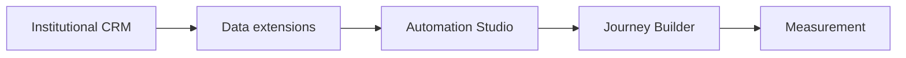

# SFMC Student Recruitment Journey Simulator

**Personal portfolio project by Pek Chansatit**

An interactive, GitHub-ready demonstration of the logic behind a consent-aware postsecondary student-recruitment journey: source data, SQL segmentation, data-quality gates, lifecycle transitions, personalized email content, and funnel measurement.

**Live demo:** [sfmc-student-journey.pekkychan.chatgpt.site](https://sfmc-student-journey.pekkychan.chatgpt.site)

> This is an independent simulation built with synthetic data. It is **not a production Seneca Polytechnic implementation**, is not connected to Salesforce, and does not claim production SFMC experience.

## What the working demo includes

- A recruitment-funnel dashboard calculated from 24 synthetic records.
- A five-stage journey: Prospect → Engaged → Event Registrant → Applicant → Enrolled.
- Event simulation for opens, clicks, registrations, application activity, enrolment, unsubscribe, and hard bounce.
- Eligibility rules that prioritize stable identity, consent, data quality, active interest, and CRM application status.
- A SQL workbench showing a Marketing Cloud Engagement Query Activity concept.
- A filterable data-extension output preview.
- An AMPscript-style email preview with first-name and program-name fallbacks.
- English/French content variation and a CTA that changes after event registration.
- Data-quality and recruitment-outcome measurement in one dashboard.

## Architecture



The CRM/institutional system remains the source of truth. Engagement influences relevance, while consent, application submission, and enrolment have higher decision priority.

## Repository evidence

| Path | What it demonstrates |
| --- | --- |
| `app/page.tsx` | Responsive dashboard and interactive simulator |
| `lib/recruitment-data.ts` | Synthetic model, entry rules, transition engine, quality logic |
| `public/sample-data/students.csv` | 24 test records, including deliberate quality edge cases |
| `sql/01_build_journey_entry.sql` | Deduplicated, consent-aware journey-entry segmentation |
| `sql/02_data_quality_summary.sql` | Operational monitoring queries |
| `sql/03_engagement_metrics.sql` | Email data-view aggregation concept |
| `email/program-event-invite.html` | AMPscript personalization and compliant footer pattern |
| `docs/implementation-map.md` | Mapping from repository behavior to SFMC responsibilities |
| `tests/portfolio-data.test.mjs` | Automated checks for data, controls, and transparency |

## Run locally

Requires Node.js 22.13 or newer.

```bash
npm ci
npm run dev
```

Then open the local URL printed by the development server.

## Validate

```bash
npm test
npm run lint
```

## Design decisions

1. **Stable identity before activation.** `ContactKey` is the cross-channel identity; email is an address, not the key.
2. **Latest record wins.** Duplicate ContactKeys are ranked by `ModifiedDate` before selection.
3. **Consent is a hard gate.** `OptedOut` and `Unknown` contacts do not enter.
4. **CRM lifecycle status outranks engagement.** `Submitted` and `Enrolled` exit recruitment nurture.
5. **Fallbacks are intentional.** Missing names never produce broken greetings or blank program copy.
6. **Measurement connects to decisions.** Data health, engagement, event registration, application, and enrolment are visible together.

## Official learning references

- [Salesforce: Retrieving and Segmenting Data with a SQL Query Activity](https://help.salesforce.com/s/articleView?id=mktg.mc_as_using_the_query_activity.htm&type=5)
- [Salesforce: AMPscript `AttributeValue()`](https://developer.salesforce.com/docs/marketing/marketing-cloud-ampscript/references/mc-ampscript-utilities/mc-ampscript-reference-utilities-attribute-value.html)
- [Salesforce: AMPscript `Empty()`](https://developer.salesforce.com/docs/marketing/marketing-cloud-ampscript/references/mc-ampscript-utilities/mc-ampscript-reference-utilities-empty.html)
- [Salesforce: Marketing Cloud Engagement Data Views](https://help.salesforce.com/s/articleView?id=mktg.mc_as_data_views.htm&type=5)

## Licence

MIT © 2026 Pek Chansatit
