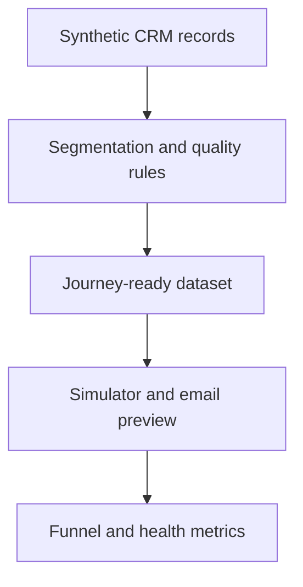
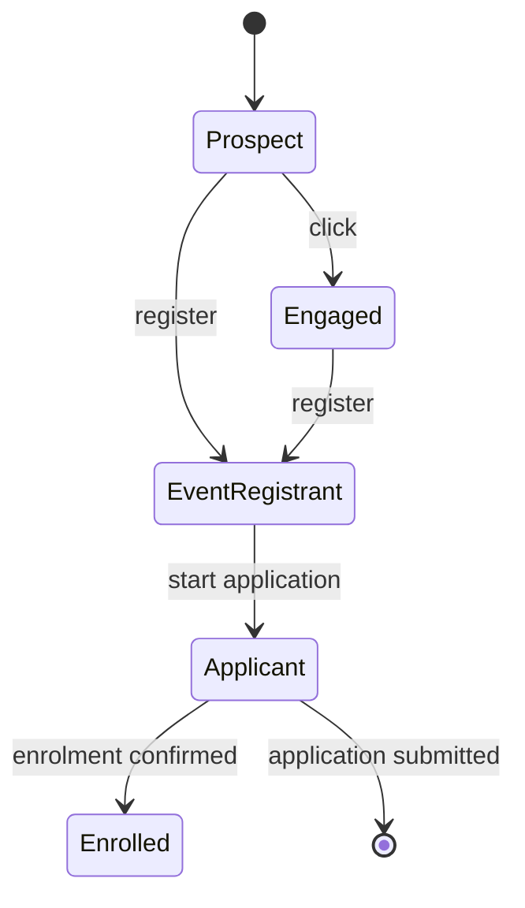

# SFMC Student Recruitment Journey Simulator

## Technical Documentation

| Document field | Value |
| --- | --- |
| Project | SFMC Student Recruitment Journey Simulator — Personal Portfolio Project |
| Author | Pek Chansatit |
| Version | 1.0 |
| Last updated | 10 August 2026 |
| Status | Working portfolio demonstration |

> [!IMPORTANT]
> This is an independent educational simulation built with synthetic data. It is not a production Seneca Polytechnic implementation, is not connected to Salesforce, and does not claim production Salesforce Marketing Cloud Engagement experience.

## 1. Purpose

The project demonstrates how student-recruitment data could be prepared, governed, activated, personalized, and measured in a solution inspired by Salesforce Marketing Cloud Engagement (SFMC). It turns platform concepts into inspectable source code and an interactive browser simulation.

The implementation is intended to demonstrate transferable skills in:

- CRM and marketing-data modelling;
- SQL segmentation and deduplication;
- consent, suppression, and data-quality controls;
- event-driven journey logic;
- AMPscript personalization with safe fallbacks and branching;
- bilingual content branching;
- recruitment-funnel measurement; and
- TypeScript, React, testing, and deployment.

## 2. Scope

### 2.1 Included

- Twenty-four synthetic recruitment records.
- Five recruitment stages: Prospect, Engaged, Event Registrant, Applicant, and Enrolled.
- A consent-aware, deduplicated journey-entry segment.
- Eight simulated events and deterministic state transitions.
- Data-quality monitoring for identity, email, consent, and duplication.
- An output-preview table with search and filters.
- An English/French email preview with safe fallback values.
- SQL and AMPscript examples that map the simulator to SFMC concepts.
- Operational, engagement, and outcome metrics.
- Automated build, artifact, and source-evidence tests.

### 2.2 Excluded

- A live Salesforce or SFMC tenant connection.
- Real student, applicant, or customer information.
- Real email delivery, SMS, advertising, or API calls.
- Persistent application state or a production database.
- Production authentication, authorization, scheduling, monitoring, or incident response.
- A claim that the simulator is endorsed by Seneca Polytechnic or Salesforce.

## 3. System context

The application is a single-page, client-interactive portfolio site. Its records are imported from a TypeScript module, held in React state, and recalculated after every simulated event. A CSV file provides downloadable evidence of the same synthetic dataset.



There is no runtime dependency on Salesforce, an external database, or an application API. Browser refresh restores the original records because the simulation is intentionally non-persistent.

## 4. Conceptual SFMC architecture


| Layer | Responsibility | Repository evidence |
| --- | --- | --- |
| Institutional CRM | Own contact identity, program interest, application status, and enrolment status | Synthetic source fields in `lib/recruitment-data.ts` and `students.csv` |
| Data Extensions | Store source, journey-entry, consent, event, and measurement attributes | Data dictionary and SQL target definitions |
| Automation Studio | Deduplicate records, apply eligibility rules, and calculate operational summaries | `sql/01_build_journey_entry.sql` and `sql/02_data_quality_summary.sql` |
| Journey Builder | Apply timing, decisions, suppression, goals, exits, and stage transitions | `transitionProspect()` and the interactive decision log |
| Content Builder | Render personalized content, fallbacks, language, and CTA variations | `email/program-event-invite.html` and the email-preview interface |
| Data Views/reporting | Aggregate delivery, engagement, and recruitment outcomes | `sql/03_engagement_metrics.sql` and dashboard metrics |

The institutional CRM is treated as the authoritative lifecycle source. Engagement may change the next message, but it cannot override consent withdrawal, application submission, or confirmed enrolment.

## 5. Technology stack

| Technology | Version or requirement | Role |
| --- | --- | --- |
| Node.js | 22.13 or newer | Local development, build, lint, and tests |
| TypeScript | 5.9.3 | Typed data model and application logic |
| React | 19.2.6 | Interactive interface and local state |
| Next.js | 16.2.6 | App-router-compatible application structure |
| vinext | 0.0.50 | Vite-compatible Next.js runtime and build |
| Vite | 8.0.13 | Development server and build orchestration |
| Cloudflare Vite plugin | 1.37.1 | Worker-compatible local and hosted runtime |
| Tailwind CSS | 4.2.1 | Styling toolchain dependency; custom interface styles live in `app/globals.css` |
| ESLint | 9.39.4 | Static code-quality checks |
| Node test runner | Node.js built-in | Automated source and rendered-output tests |
| Drizzle ORM | 0.45.2 | Available database scaffold; not used by the simulator |

The project declares ECMAScript modules through `"type": "module"` in `package.json`.

## 6. Repository structure

| Path | Technical responsibility |
| --- | --- |
| `app/page.tsx` | Page composition, React state, filters, simulator controls, email preview, and metrics |
| `app/globals.css` | Responsive visual system and component styling |
| `app/layout.tsx` | Root document layout and metadata |
| `lib/recruitment-data.ts` | Domain types, synthetic records, segmentation, quality checks, transitions, SQL, and AMPscript samples |
| `public/sample-data/students.csv` | Downloadable synthetic source dataset |
| `sql/01_build_journey_entry.sql` | Journey-entry query concept |
| `sql/02_data_quality_summary.sql` | Data-quality monitoring query concept |
| `sql/03_engagement_metrics.sql` | Thirty-day engagement aggregation concept |
| `email/program-event-invite.html` | AMPscript email implementation example |
| `docs/data-dictionary.md` | Concise source-field definitions |
| `docs/implementation-map.md` | Repository-to-SFMC responsibility mapping |
| `tests/portfolio-data.test.mjs` | Dataset, SQL-control, and disclosure tests |
| `tests/rendered-html.test.mjs` | Built Worker response and HTML metadata test |
| `worker/index.ts` | Cloudflare Worker entry point and image handling |
| `vite.config.ts` | vinext, Sites, Cloudflare, and local-runtime configuration |
| `scripts/build-verified.sh` | Bounded production build and artifact validation |
| `scripts/validate-artifact.mjs` | Cross-platform validation of the Worker export and hosted manifest |
| `scripts/validate-artifact.sh` | Confirms the Worker export and hosted manifest are valid |
| `.openai/hosting.json` | Hosted-project metadata; no D1 or R2 binding is configured |

## 7. Domain model

### 7.1 Prospect record

| Field | Type | Purpose |
| --- | --- | --- |
| `id` | String | Synthetic row identifier used by the browser UI |
| `contactKey` | String | Stable cross-channel identity used for deduplication |
| `firstName` | String | Greeting personalization; may be blank to test fallback logic |
| `lastName` | String | Display and identification field |
| `emailAddress` | String | Delivery address; not used as the stable identity |
| `programCode` | String | Program-interest segmentation value, such as `CPP` |
| `programName` | String | Human-readable personalized program name |
| `intake` | String | Intended academic term, such as `2027-WINTER` |
| `campus` | String | Campus associated with the program interest |
| `studentType` | Enum | `Domestic` or `International` |
| `preferredLanguage` | Enum | `English` or `French` |
| `stage` | Enum | Current journey stage |
| `consentStatus` | Enum | `OptedIn`, `OptedOut`, or `Unknown` |
| `activeInterest` | Boolean | Whether the program interest remains active |
| `applicationStatus` | Enum | `NotStarted`, `InProgress`, `Submitted`, or `Enrolled` |
| `emailValid` | Boolean | Pre-evaluated delivery-quality and suppression flag |
| `eventRegistered` | Boolean | Controls event-reminder and CTA content |
| `lastEngagementDate` | ISO date string | Most recent simulated engagement date |
| `modifiedDate` | ISO timestamp string | Determines which duplicate source row is newest |

`id` and `contactKey` have different purposes. `id` identifies a demo row; `contactKey` represents the durable subscriber/contact identity that should remain stable even if an email address changes.

### 7.2 Synthetic edge cases

The dataset deliberately contains:

- one missing ContactKey;
- two records flagged with invalid email;
- one duplicate ContactKey group;
- one record with unknown consent;
- one opted-out record;
- one inactive program interest;
- records outside the target program or intake;
- submitted and enrolled lifecycle states;
- a missing first name; and
- a missing program name.

These conditions make the controls visible instead of presenting only clean, idealized data.

## 8. Segmentation and eligibility

### 8.1 Processing sequence

`segmentProspects()` applies the rules in this order:

1. Remove records without a usable ContactKey.
2. Group records by ContactKey.
3. Keep the row with the newest `modifiedDate` in each group.
4. Limit scope to program `CPP` and intake `2027-WINTER`.
5. Require `ConsentStatus = OptedIn`.
6. Require active program interest.
7. Require a valid email flag.
8. Exclude `Submitted` and `Enrolled` application statuses.

With the supplied dataset, 12 of 24 source rows are journey-ready after scope, identity, deduplication, consent, quality, and lifecycle rules are applied.

### 8.2 Eligibility expression

```text
eligible =
  hasStableContactKey
  AND latestRecordForContactKey
  AND programCode = CPP
  AND intake = 2027-WINTER
  AND consentStatus = OptedIn
  AND activeInterest = true
  AND emailValid = true
  AND applicationStatus NOT IN (Submitted, Enrolled)
```

### 8.3 SQL implementation concept

`sql/01_build_journey_entry.sql` uses `ROW_NUMBER()` partitioned by `ContactKey` and ordered by `ModifiedDate DESC`. Records ranked first are filtered into `DE_Recruitment_CPP_2027W`. The file documents an **Overwrite** target operation so the output represents the current qualified population rather than an ever-growing append history.

The SQL is evidence of design logic; it has not been executed in an SFMC account. Field types, target primary keys, query syntax, and automation timing must be validated in the destination business unit before production use.

## 9. Journey state and event engine

### 9.1 Lifecycle stages

| Stage | Meaning | Typical next action |
| --- | --- | --- |
| Prospect | Inquiry captured | Welcome and program information |
| Engaged | Contact clicked or expressed interest | More relevant program or event content |
| Event Registrant | Event registration captured | Reminder and attendance support; suppress repeated registration CTA |
| Applicant | Application started or submitted | Completion support or recruitment exit |
| Enrolled | Enrolment confirmed | Transition to student communications |

### 9.2 Event transition matrix

| Simulator event | State mutation | Exit? | Decision message |
| --- | --- | --- | --- |
| Open email | No lifecycle change | No | Record the open for measurement |
| Click program | Prospect becomes Engaged; later stages remain unchanged | No | Select the engagement branch |
| Register event | Stage becomes Event Registrant; `eventRegistered = true` | No | Suppress the repeated registration CTA |
| Start application | Stage becomes Applicant; status becomes InProgress | No | Switch to application-completion support |
| Submit application | Stage becomes Applicant; status becomes Submitted | Yes | Exit recruitment nurture |
| Confirm enrolment | Stage and application status become Enrolled | Yes | Transition to student communications |
| Unsubscribe | Consent becomes OptedOut | Yes | Suppress and exit the contact |
| Hard bounce | `emailValid = false` | Yes | Suppress the email channel and exit |



Unsubscribe and hard-bounce events exit from any stage. The decision log retains the five most recent simulated events, with exit events visually identified.

### 9.3 Decision priority

1. Consent withdrawal or channel suppression.
2. Confirmed enrolment.
3. Submitted application.
4. Application progress and event registration.
5. Engagement signals such as clicks and opens.

This priority prevents a high-engagement signal from keeping an ineligible or completed contact inside recruitment nurture.

## 10. Personalization and content rules

The browser email preview evaluates four attributes: first name, program name, preferred language, and event-registration status.

| Condition | Rendered behavior |
| --- | --- |
| First name is populated | Use the source first name |
| First name is empty | Use `there` |
| Program name is populated | Use the source program name |
| Program name is empty | Use `your selected program` |
| Preferred language is French | Render the French subject context, greeting, body, and CTA |
| Preferred language is English | Render the English content |
| Event registration is false | CTA asks the contact to reserve a spot |
| Event registration is true | CTA links to registration details and suppresses a repeated signup request |

The standalone email example uses `AttributeValue()` and `Empty()` patterns, dynamic CTA text, SFMC sender-identity placeholders, and an unsubscribe-center URL. It sends no email and uses a placeholder destination domain.

## 11. Data-quality controls

`qualitySummary()` calculates four operational checks:

| Check | Supplied-data result | Operational response |
| --- | ---: | --- |
| Missing ContactKey | 1 | Block journey identity and route for source correction |
| Invalid email flag | 2 | Suppress from the email channel |
| Duplicate ContactKey groups | 1 | Retain the newest record and investigate source duplication |
| Unknown consent | 1 | Hold outside the journey until consent is resolved |

`sql/02_data_quality_summary.sql` expresses the same categories as an Automation Studio monitoring query targeting `DE_Recruitment_Data_Quality_Summary`.

The simulator trusts the `emailValid` flag; it does not perform address syntax, domain, mailbox, or deliverability validation itself.

## 12. Measurement framework

The dashboard separates three classes of measurement:

| Measurement class | Examples | Intended decision owner |
| --- | --- | --- |
| Operational health | Invalid email, missing identity, duplicate identity, failed mapping | Marketing operations / data operations |
| Engagement | Send, open, click, bounce, unsubscribe, event registration | Campaign and content owners |
| Recruitment outcome | Application start, submission, enrolment | Recruitment and journey-design owners |

Initial synthetic-dataset values are:

| Metric | Value | Calculation |
| --- | ---: | --- |
| Source records | 24 | All source rows |
| Journey-ready | 12 | Deduplicated records passing every eligibility rule |
| Event registrations | 9 | Records with `eventRegistered = true` |
| Application activity | 5 | InProgress, Submitted, or Enrolled application status |
| Enrolled | 1 | Records in the Enrolled journey stage |
| Displayed usable identities | 20 | Source rows minus invalid-email, missing-key, and unknown-consent counts |

`sql/03_engagement_metrics.sql` demonstrates a 30-day aggregation from SFMC `_Job`, `_Sent`, `_Open`, `_Click`, `_Bounce`, and `_Unsubscribe` data views. Unique open and click conditions use `IsUnique = 1`.

## 13. Interface behavior

The page maintains these client-side state values:

- working prospect records;
- selected simulator contact;
- selected email-preview contact;
- the latest five decision-log entries;
- search text;
- program and intake filters;
- the `OptedIn only` filter; and
- the selected workbench tab.

Derived values are recalculated from current state. Journey-ready records use `useMemo`; quality, funnel, application, registration, and filtered-table values are recalculated during rendering. The **Reset simulation** action restores the original prospect dataset and default simulated contact.

## 14. Functional traceability

| Requirement | Implementation | Verification evidence |
| --- | --- | --- |
| F-01: Segment eligible prospects | `segmentProspects()` and journey-entry SQL | SQL assertions and visible target count |
| F-02: Deduplicate by stable identity | `Map` by ContactKey and SQL `ROW_NUMBER()` | Duplicate sample records and query test |
| F-03: Enforce consent and lifecycle exits | Eligibility checks and transition engine | Interactive checks, exit log, and SQL assertions |
| F-04: Simulate recruitment events | `transitionProspect()` | Eight event controls and updated state |
| F-05: Monitor data quality | `qualitySummary()` and quality SQL | Quality workbench view |
| F-06: Preview target records | Search, program, intake, and consent filters | Output-preview table |
| F-07: Personalize content safely | Fallbacks, language branch, and CTA branch | Email preview and AMPscript example |
| F-08: Measure the funnel | Derived React metrics and engagement SQL | Funnel and activation-health views |
| F-09: Make scope transparent | Page disclosure, footer, README, and synthetic data | Automated README disclosure test |

## 15. Build and test design

### 15.1 Commands

```bash
npm ci
npm run dev
npm test
npm run lint
```

`npm test` first runs the verified production build and then executes both Node test files.

### 15.2 Current automated checks

- The CSV contains exactly 24 synthetic records.
- Required identity, consent, and application-status columns exist.
- The journey-entry SQL includes deduplication, consent, email-quality, and lifecycle gates.
- The README identifies the project as personal, synthetic, and non-production.
- The built Worker returns a successful HTML response.
- The rendered output contains the development-preview metadata required by the host.
- The artifact validator confirms `dist/server/index.js` exports `default.fetch` and that the packaged hosting manifest parses as JSON.

### 15.3 Build safeguards

The standard `dev`, `build`, `start`, `test`, `lint`, and `validate:artifact` scripts are cross-platform. The production build invokes vinext and then runs `scripts/validate-artifact.mjs`, which fails when the Worker entry point or packaged hosting manifest is missing. An additional Linux-hosting script, `scripts/build-verified.sh`, retains strict shell handling and bounded execution for managed build environments.

## 16. Runtime and deployment

`vite.config.ts` composes vinext, the Sites packaging plugin, and the Cloudflare Vite plugin. `worker/index.ts` handles the vinext image-optimization route and forwards other requests to the app-router handler.

The current hosted configuration has no D1 database or R2 bucket. `db/schema.ts` is intentionally empty, so Drizzle is scaffolded but not used by this application. No data survives a browser refresh.

The repository is designed to run locally and can be deployed later to a public host chosen by the project owner. No public demo URL is included in the portfolio documentation. Repository visibility should be tested in a private browser before the project is shared with recruiters.

## 17. Privacy, consent, and security

### 17.1 Implemented safeguards

- All names, addresses, statuses, events, and metrics are synthetic.
- Sample email addresses use the non-operational `example.ca` domain.
- Explicit OptedIn consent is required for journey entry.
- OptedOut and Unknown consent states are excluded.
- Unsubscribe and hard-bounce events immediately produce an exit decision.
- Submitted and Enrolled lifecycle statuses are excluded from recruitment entry.
- No Salesforce credentials, API keys, or secrets are required.
- No browser interaction sends messages or writes data to an external service.

### 17.2 Production requirements not represented

A real implementation would also require access control, business-unit governance, consent source and timestamp history, data-retention policies, encryption, audit logging, contact-deletion procedures, sender authentication, preference-centre integration, legal review, and operational alerting.

## 18. Known limitations

1. **No platform execution.** SQL and AMPscript are illustrative and have not been validated inside a specific SFMC business unit.
2. **No persistence.** Simulation changes exist only in browser memory.
3. **No enforced event order.** The UI permits events after an exit and permits unrealistic sequences; the transition function demonstrates outcomes rather than a complete state machine guard system.
4. **Blank-key SQL hardening.** The TypeScript logic rejects an empty ContactKey, while the illustrative entry SQL checks only `IS NOT NULL`. A production query should explicitly reject both null and blank/whitespace values.
5. **Language implementation split.** The browser preview supports English and French, while the standalone HTML/AMPscript example contains English body copy. Production content should implement the same language branch in the sendable asset.
6. **Consent is a snapshot.** The demo stores current consent status but not source, timestamp, jurisdiction, purpose, or audit history.
7. **Email validity is pre-calculated.** The simulator does not validate an address or consume bounce classifications.
8. **Illustrative health score.** The displayed usable-identity calculation subtracts selected issue counts but does not remove duplicate groups or account for overlapping conditions.
9. **Fixed demonstration dates.** Dates do not advance with the system clock.
10. **Limited automated coverage.** The current tests verify key artifacts and disclosure, not every transition, accessibility rule, localization branch, or SQL result.

## 19. Production hardening recommendations

Before adapting the concept to a real organization:

1. Confirm the CRM ownership model and define a durable ContactKey.
2. Design normalized source and sendable Data Extensions with documented primary keys and retention rules.
3. Store consent purpose, source, timestamp, jurisdiction, and evidence—not only current status.
4. Validate null, blank, malformed, and conflicting identity values before deduplication.
5. Define Journey Builder entry, re-entry, frequency-cap, suppression, exit, and goal settings.
6. Implement guarded state transitions so terminal states cannot re-enter recruitment without an approved business rule.
7. Build English and French Content Builder assets with testable fallback content.
8. Configure sender profiles, delivery profiles, authentication, preference management, and publication controls.
9. Add exception handling and alerts for automation failures, row-count anomalies, and stale data.
10. Reconcile engagement to CRM applications and enrolments using an approved attribution model.
11. Add unit, integration, rendering, accessibility, localization, and user-acceptance tests.
12. Complete privacy, security, legal, data-governance, and operational-readiness reviews.

## 20. Suggested next technical increments

| Priority | Increment | Portfolio value |
| ---: | --- | --- |
| 1 | Add unit tests for every event transition and segment edge case | Demonstrates test-driven business-rule implementation |
| 2 | Align the standalone email template with the English/French UI branch | Demonstrates consistent personalization design |
| 3 | Add guarded terminal states and a formal transition table in code | Demonstrates robust journey orchestration |
| 4 | Add a generated dataset script with deterministic fixtures | Demonstrates reproducible test-data engineering |
| 5 | Add campaign and event identifiers to the measurement model | Demonstrates clearer attribution and reporting |
| 6 | Add an architecture decision record for ContactKey and consent modelling | Demonstrates technical governance and decision traceability |

## 21. Official learning references

- [Salesforce: Retrieving and Segmenting Data with a SQL Query Activity](https://help.salesforce.com/s/articleView?id=mktg.mc_as_using_the_query_activity.htm&type=5)
- [Salesforce: AMPscript `AttributeValue()`](https://developer.salesforce.com/docs/marketing/marketing-cloud-ampscript/references/mc-ampscript-utilities/mc-ampscript-reference-utilities-attribute-value.html)
- [Salesforce: AMPscript `Empty()`](https://developer.salesforce.com/docs/marketing/marketing-cloud-ampscript/references/mc-ampscript-utilities/mc-ampscript-reference-utilities-empty.html)
- [Salesforce: Marketing Cloud Engagement Data Views](https://help.salesforce.com/s/articleView?id=mktg.mc_as_data_views.htm&type=5)

## 22. Document control

| Version | Date | Author | Change |
| --- | --- | --- | --- |
| 1.0 | 10 August 2026 | Pek Chansatit | Initial technical documentation for the portfolio simulator |

---

**Licence:** MIT © 2026 Pek Chansatit
